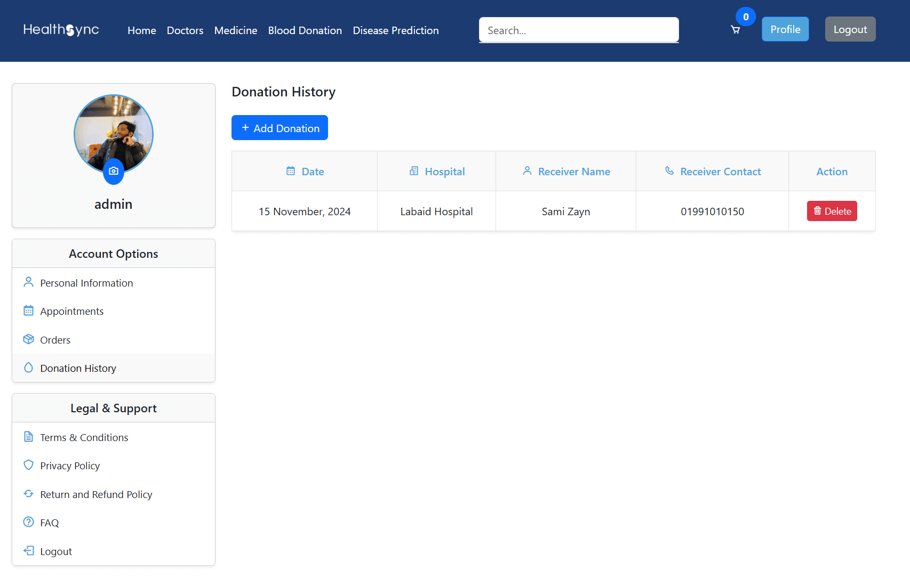
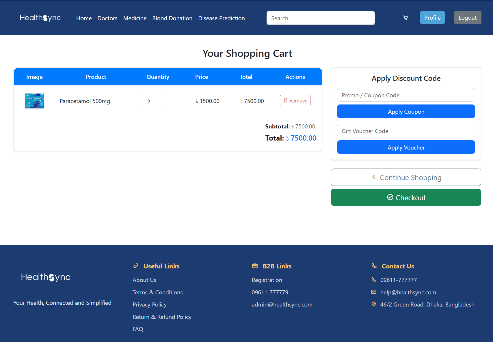

# HealthSync

Revolutionizing healthcare with intuitive appointment management, order tracking, and donation services.

## Overview

HealthSync is a comprehensive healthcare management platform designed to simplify medical appointments, manage user profiles, track orders, and more. This project aims to revolutionize the health industry by providing an intuitive interface for patients, doctors, and administrators.


## Features

- User profile management
- Doctor appointment booking
- Donation tracking
- Product and order management
- Admin dashboard for managing users, doctors, and orders
- Fully responsive UI using Jazzmin
- Secure authentication with OTP

## Installation

1. Clone the project

```bash
  git clone https://github.com/BlinkZ404/HealthSync
```

2. Install dependencies

```bash
  pip install -r requirements.txt
```

3. Go to the project directory

```bash
  cd HealthSync
```

4. Migrations (Optional)

```bash
  python manage.py migrate
```

5. Start the server

```bash
  python manage.py runserver
```

6. Access the server

```bash
  http://127.0.0.1:8000/
```

7. Access the Admin Panel

```bash
  http://127.0.0.1:8000/admin
```


## Demo Account (For Testing Only)

-  **username: admin**

- **password: test1**


## Requirements

- **Django 5.1.2 - Web framework**

- **Jazzmin 3.0.1 - Admin theme**

- **SQLite - Database**

- **Bootstrap 5 - Frontend framework**

## Requirements

- **Asgiref 3.8.1**

- **Django 5.1.2**

- **Jazzmin 3.0.1**

- **Pillow 11.0.0**

- **Sqlparse 0.5.1**

- **Tzdata 2024.2**

## Screenshots


### Login and OTP Request

- Secure login using email-based OTP authentication for a seamless user experience.

### Profile Management

- Manage personal details, update profile information, and track user-specific data.

### Doctor Page

- Browse and book appointments with doctors based on specialties and availability.

### Medicine Page


- Explore and purchase medicines with detailed product descriptions.

### Appointment History

- View past and upcoming appointments along with their status.

### Order History

- Track the status and details of previous orders.

### Donation History

- View donation records, including receiver details and hospital information.

### Cart

- Manage items in the cart, update quantities, and proceed to checkout.

### Checkout

- Finalize orders with delivery and payment details.

### Admin Panel

- Comprehensive administrative dashboard to manage users, doctors, products, orders, and more.

